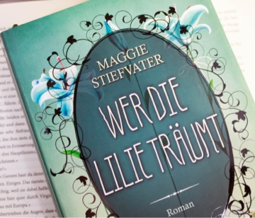

Endlich ist der Herbst angekommen! Bei uns vor der Tür sind die Blätter schon alle verfärbt und alle typischen Farben dieser Jahreszeit zeigen sich schon. Falls euch aber noch die passenden Gefühle fehlen, habe ich euch eine Liste mit Büchern zusammengestellt, die meiner Meinung nach ideal zum Herbst passen. Damit solltet ihr sehr schnell in Herbst Stimmung kommen.

## 1. Harry Potter

Wir fangen mit einer Reihe an, die bei mir alle möglichen Erinnerungen und Gefühle weckt. Für mich gehört Harry Potter zum Herbst dazu und in der Regel schaue ich mir um Halloween auch immer den ersten Film nochmal an. Es geht doch nichts über Harry Potter, während man gemütlich auf dem Sofa sitzt, unter einer Decke verkrümelt und draußen stürmt es.

## 2. Tribute von Panem

Für mich gehört die "Tribute von Panem"-Reihe zu den besten Jugendystopien. Ich habe bis jetzt noch keine gefunden die der Reihe auch nur Ansatzweise das Wasser reichen konnte. Bei mir weckt die Reihe auch die Herbstgefühle, wenn Katniss durch den Wald geht, auf der Jagd ist und sich dabei mit Gale unterhält. Außerdem, passend zum Herbst fängt auch mein Fantasy-Herz immer an schneller zu schlagen.

## 3. Graphic Novels

Es gibt einige Graphic Novels die ich euch für den Herbst nur ans Herz legen kann. Darunter zählen zum Beispiel "Pumpkinheads" von Rainbow Rowell und "Mooncakes" von Suzanne Walker. Beide sind auf englisch aber durch die Bilder sehr leicht zu lesen und zu verstehen. Bei mir haben beide im letzten Jahr die Herbstgefühle wecken können.

## 4. Das Reich der sieben Höfe

Die "das Reich der sieben Höfe"-Reihe war meine erste Reihe von Sarah J. Maas und hat mich völlig überzeugen können. Ich finde gerade die ersten beiden Teile passen ideal in den Herbst. Ich möchte nicht zu viel verraten, nur so viel: es gibt Jahreszeiten Höfe! Der zweite Teil war übrigens mein Favorit aus der Reihe.

## 5. Two can keep a Secret

"Two can keep a Secret" steht stellvertrentend für alle Bücher von der Autorin Karen McManus. Thriller passen meiner Meinung nach perfekt in die Jahreszeit, doch ich bin da etwas empfindlich und deshalb greife ich lieber zu Jugenthrillern. "Two can keep a Secret" ist ein eigenständiger Roman und ich kann den unter Anderem deswegen für Einsteiger empfehlen.

## 6. These witches don't burn

Dieses Buch hat mich letztes Jahr komplett überrascht. Ich war eigentlich nur auf der Suche nach einem guten Hexen Roman, denn leider gibt es meiner Meinung nach viel zu wenige davon. Als ich dann im Klappentext auch noch gesehen hatte, dass die Protagonistin homosexuell ist hab ich das Buch direkt gekauft und gelesen. Ich fand es wirklich richtig gut. Die Magie steht im Vordergrund und die Charaktere sind alle sehr sympathisch.

## 7. Elfenkrone

Die "Elfenkrone"-Reihe von Holly Black passt für mich perfekt in den Herbst. In der Welt, welche die Autorin für uns geschaffen hat ist sowieso alles sehr grün und durch die Brutalität die durch die Geschichte dazu kommt, passt sie perfekt in den Herbst. Mir persönlich hat die Reihe leider nicht so gut gefallen, das lag aber viel mehr an den Charakteren. Ich wurde leider einfach nicht warm mit denen, die Geschichte war jedoch unfassbar spannend und nur deswegen habe ich alle drei Teile gelesen.

## 8. Die Ravenboys

Jedes Jahr wenn der Herbst so langsam kommt, muss ich an diese Reihe und die Charaktere denken. Sie setzt auch im Spätsommer an und weckt dadurch auch alle Herbstgefühle. Die Charaktere sind so besonders und die Geschichte ist zusammen mit dem Schreibstil sehr magisch. Mit dem Herbst verbinde ich immer direkt diese Reihe. Leider sehe ich sie viel zu selten irgendwo, dabei hat die Reihe so viel Liebe verdient!

## 9. Carry On

Hexen und Zauberer gehören zum Herbst einfach dazu und deshalb muss natürlich auch die "Simon Snow"-Reihe von Rainbow Rowell mit auf meine Liste. Die Geschichte ist wirklich sehr empfehlenswert, auch wenn sie am Anfang an Harry Potter erinnert. Das lässt aber mit der Zeit nach, denn Simon, seine Freunde und die Welt haben wirklich nichts gemein mit Harry Potter. Den ersten Teil gibt es sogar auf deutsch unter dem Titel "Aufstieg und Fall des außerordentlichen Simon Snow". Ich persönlich würde sie aber auf englisch eher empfehlen, da der Sarkusmus und der Humor des Buches im orinalen viel besser rüberkommt.

## 10. Redwood Love

Auch wenn ich im Herbst vermehrt zu Fantasy und Science Fiction Büchern greife, hat mich 2018 der erste "Redwood Love"-Teil überzeugen können. Gerade das Setting weckt die ersten Herbstgefühle und die Liebesgeschichte tut ihr übriges dazu. Wer ein Fan von der Serie "Gilmore Girls" ist, wird mit dieser Reihe auch seinen Spaß haben. Mir persönlich hat sie gut gefallen, ganz besonders sogar der zweite Band.