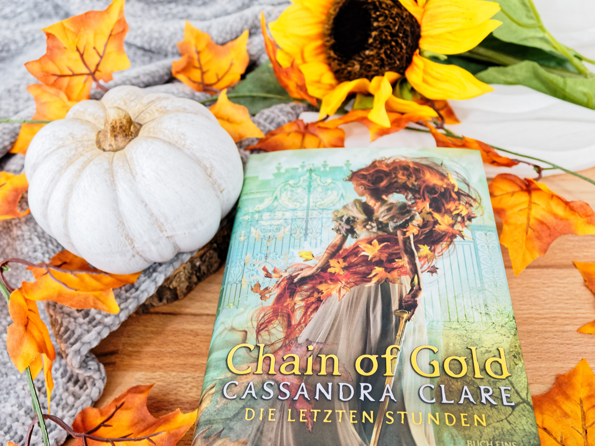
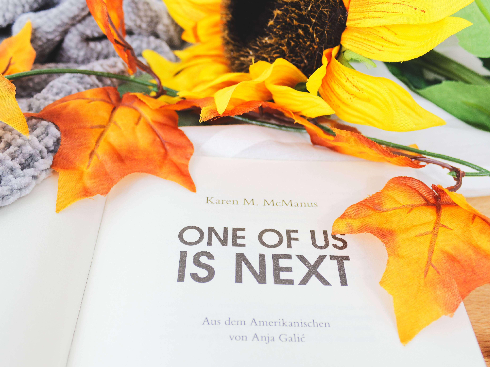
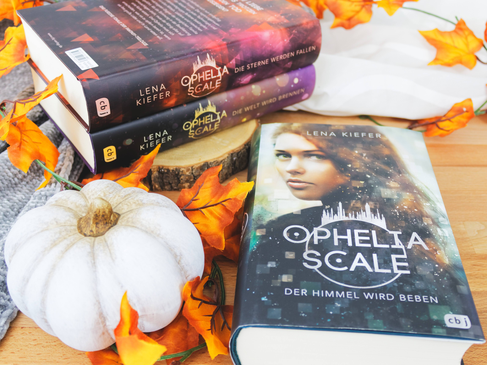
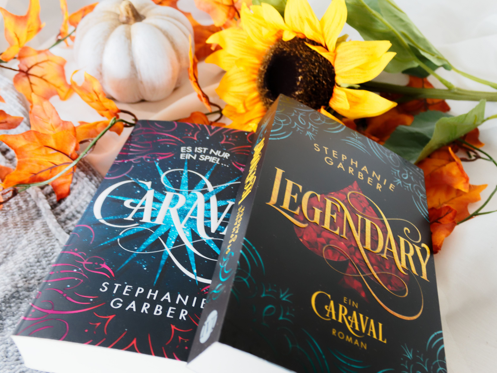
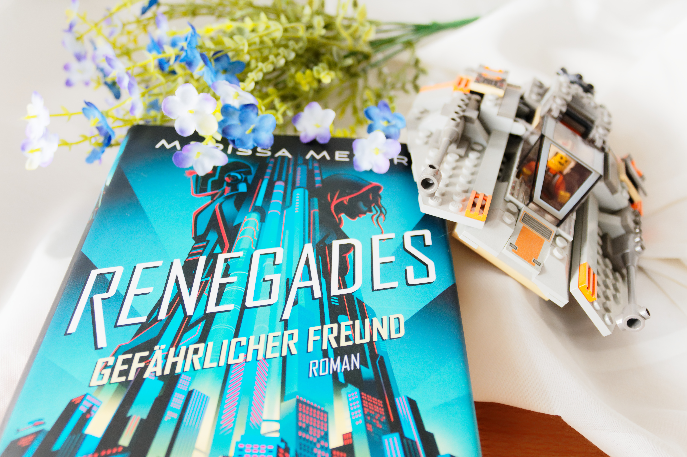
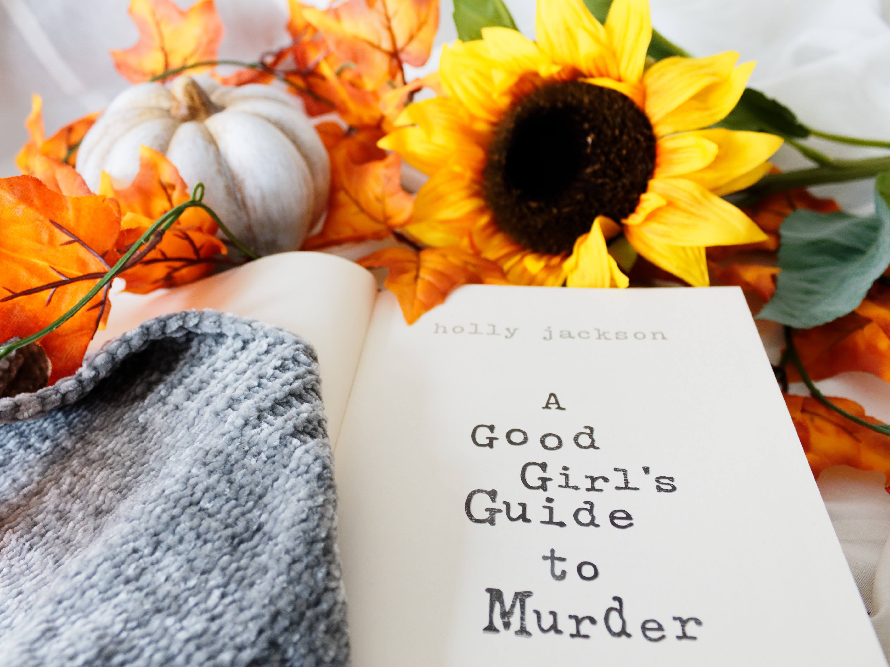
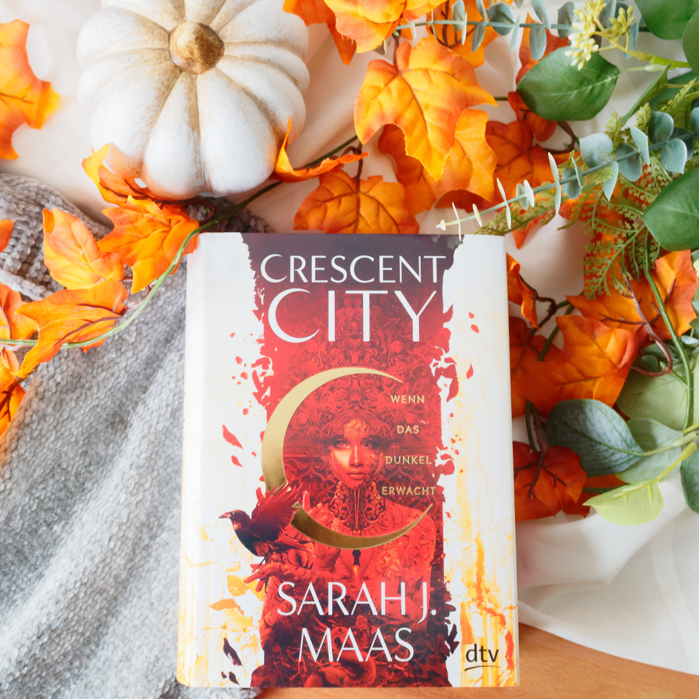
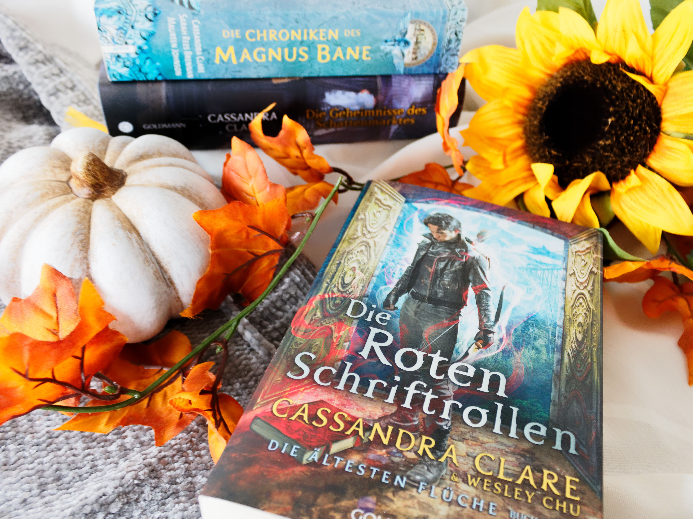

Der Sommer hat sich endlich komplett verabschiedet, denn seit einigen Tagen ist es ungemütlich nass kalt draußen und quasi am dauer regnen. Ich persönlich liebe gerade den "Golden Summer", wenn die Sonne noch scheint, es aber kälter draußen wird und die Blätter sich anfangen zu verfärben. Um die ganzen Herbst Gefühle zu erwecken habe ich mir für diesen Herbst eine Leseliste erstellt die ich euch in diesem Post vorstellen werde.

## 1. Chain of Gold

Wie einige von euch bestimmt wissen bin ich ein totaler Jahreszeiten Leser. Sobald die ersten Herbst Vibes spürbar sind habe ich unglaubliche Lust auf Fantasy/Science Fiction Bücher und viel weniger auf Romance. Es wundert einige deswegen vielleicht gar nicht, das ich mir Chain of Gold für den Herbst aufbewahrt habe. Zu aller erst finde ich das Cover total herbstlich durch die Farbwahl. Das rot von Cordelias Haaren und dann das grün drumherum.  Ich liebe es einfach!

Außerdem wird es wieder Zeit für ein Buch aus der Schattenjägerwelt und ich freu mich schon unglaublich darauf!

## 2. One of us is next

Ich persönlich finde auch, dass Thriller im Herbst immer gehen. Da ich aber eine sehr blühende Fantasie habe, greife ich doch lieber zu Jugendthrillern, mit denen kann ich Nachts wenigstens noch beruhigt schlafen.

Letztes Jahr habe ich "One of us is lying" gelesen und war hin und weg von dem Buch! Es war super spannend, etwas gruselig und ich hab mir so dermaßen den Kopf darüber zerbrochen wer der Täter ist! Ich hatte wirklich richtig viel spaß beim lesen und deshalb war für mich klar, dass der zweite Teil "One of us is next" auch auf meine Leseliste wandern musste.

## 3. Ophelia Scale

Ophelia Scale hatte letztes Jahr schon mein Interesse geweckt, egal wohin ich schaute im Internet ich begegnete dieser Reihe. Der Hype wirkte aber zuerst etwas abschreckend auf mich und deshalb wartete ich bis dieses Jahr um mich der Reihe von Lena Kiefer zu widmen. Der erste Teil konnte mich komplett überzeugen. Er war super spannend, die Protagonistin Ophelia ist ein toughes Mädchen und das Ende hat mich komplett schockiert zurück gelassen. Deshalb hab ich mir für den Herbst Teil 2 und Teil 3 vorgenommen. Beide Bücher lese ich in meinem kleinen Bücherclub und ich freu mich schon sehr darauf!

## 4. Die Tribute von Panem X

Mein Herbst Herz schlägt immer etwas höher wenn ich an die Tribute von Panem denke. Für mich ist eine der besten Dystopien überhaupt! Deshalb habe ich auch zuerst skeptisch auf das neue Buch aus der Reihe reagiert, konnte meine Neugier aber am Ende nicht zügeln und habe es mir trotzdem geholt. Ich hoffe ich schaffe es in diesem Herbst die Geschichte rund um den Bösewicht aus der "Tribute von Panem"-Reihe Präsident Snow zu lesen und ich hoffe auch das sie mich begeistern kann.

## 5. Legendary

Letztes Jahr im Herbst habe ich den ersten Band der "Caraval"-Trilogie gelesen und seit dem verbinde ich automatisch mit der Reihe den Herbst. "Caraval" hatte mir wirklich richtig gut gefallen,, obwohl das Ende super verwirrend für mich war. So richtig durchgeblickt habe ich da bis heute noch nicht, aber irgendwie hat mir genau das so gut gefallen. Da dieses Jahr endlich der letzte Teil der Reihe erschienen ist, habe ich mir dann endlich vorgenommen "Legendary" vom Sub zu befreien. Ich hoffe es wird mir mindestens genauso gut gefallen wie der erste Band.

## 6. Renegades

Von Marissa Meyer habe ich tatsächlich noch gar kein Buch gelesen, obwohl mir von sehr vielen immer wieder die "Cinder"-Reihe empfohlen wurde. Trotzdem habe ich mich dafür entschieden mit Renegades zu starten, was einfach daran lag das es nicht eine so lange Reihe ist. Die "Renegades"-Reihe besteht auch drei Teilen und Teil 1 und 2 wurde sogar auf deutsch übersetzt. Der letzte Teil wird leider nicht übersetzt werden, aber ich hoffe das ich durch die ersten beiden Teile den letzten Band auf englisch verstehen werde.

## 7. A Good Girl's guide to Murder

Wie weiter oben schon erwähnt finde ich Thriller einfach total passend für den Herbst und deshalb habe ich mir auch noch "A Good Girl's guide to Murder" von Holly Jackson ausgesucht. Das Buch hat super viele positive Rezensionen bekommen und ich bin sehr gespannt worum es geht, denn den Klappentext habe ich mir ausnahmsweise einmal nicht durchgelesen. Ich lasse mich also hier komplett überraschen.

## 8. Gut gegen Nordwind / Alle sieben Wellen

Gut gegen Nordwind liegt schon seit einer gefühlten Ewigkeit auf meinem Sub und ich weiß von meiner [besten Freundin](https://www.instagram.com/whatjanereads/), dass es auch ganz gut in den Herbst oder Frühling passt. Außerdem hat ihr das Buch so gut gefallen, dass sie es mir immer und immer wieder empfohlen hat und es mir dann schließlich auch geschenkt hat. Wird also höchste Zeit das ich es endlich lese und hoffentlich gefällt es mir genauso gut.

## 9. Crescent City

Eins der wohl am meisten gehypten Bücher aus diesem Jahr. Sarah J. Maas hat nach ihrer "Reich der sieben Höfe" und "Throne of Glass" Reihe endlich ein neues Buch rausgebracht und es ist auch direkt der erste Band von einer Reihe. Von dem Buch habe ich schon einiges gehört, mich jedoch bis heute noch nicht mit den Meinungen im Detail auseinander gesetzt. Mir haben bis jetzt beide Reihen von der Autorin sehr gut gefallen und ich möchte hier auch sehr unvoreingenommen rangehen in der Hoffnung das meine Erwartungen dann nicht zu hoch sind. Im Übrigen habe ich mir sogar den Klappentext nicht richtig durchgelesen.

## 10. Die roten Schriftrollen

Meiner Meinung nach geht Cassandra Clare einfach immer und ich kenne mich mittlerweile auch so gut, dass ich weiß sobald ich "Chain of Gold" beendet habe, werde ich Lust auf weitere Bücher der Autorin haben. Zum Glück habe ich noch den ersten Teil der "Magnus und Alec"-Reihe ungelesen im Regal stehen.

***

Ich hoffe ich konnte euch eventuell ein bisschen Inspiration für eure Herbst Leseliste liefern. Demnächst werde ich euch auch eine Herbst Empfehlungs Leseliste liefern, wo ich euch Bücher vorstellen werde, die meiner Meinung nach perfekt in den Herbst passen.