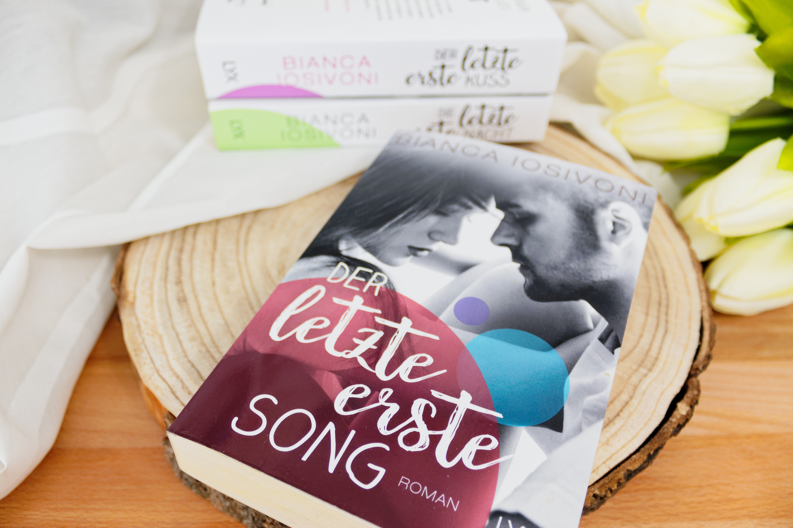
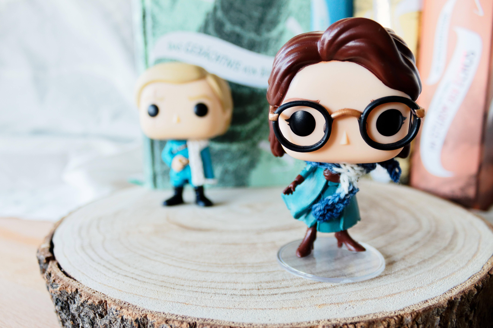
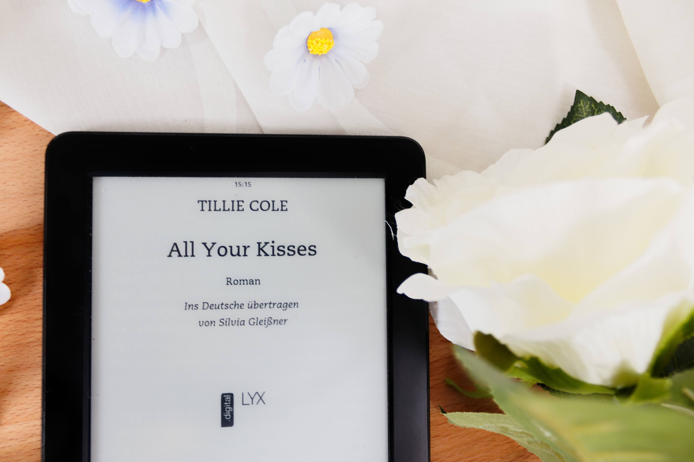
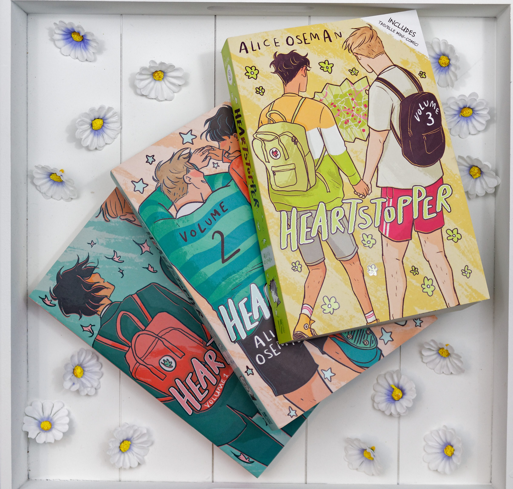
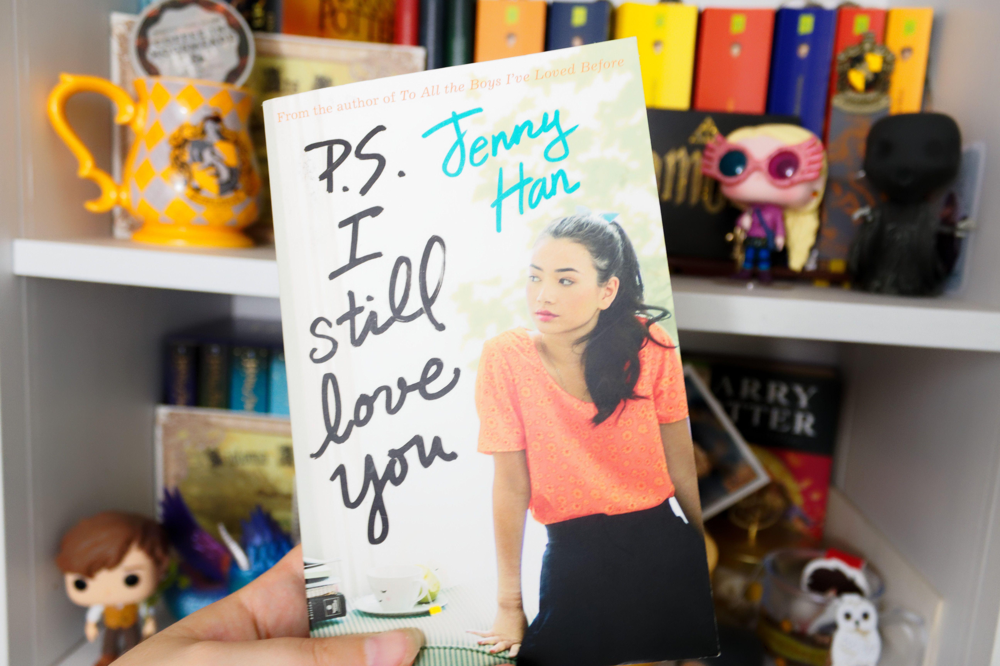
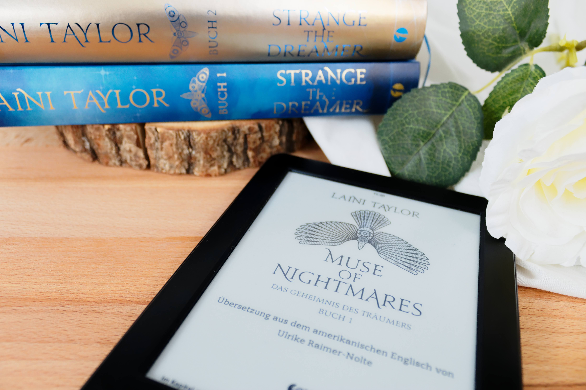
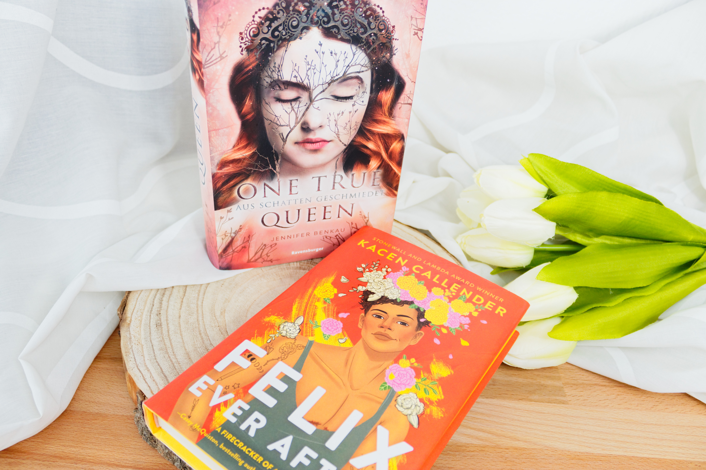
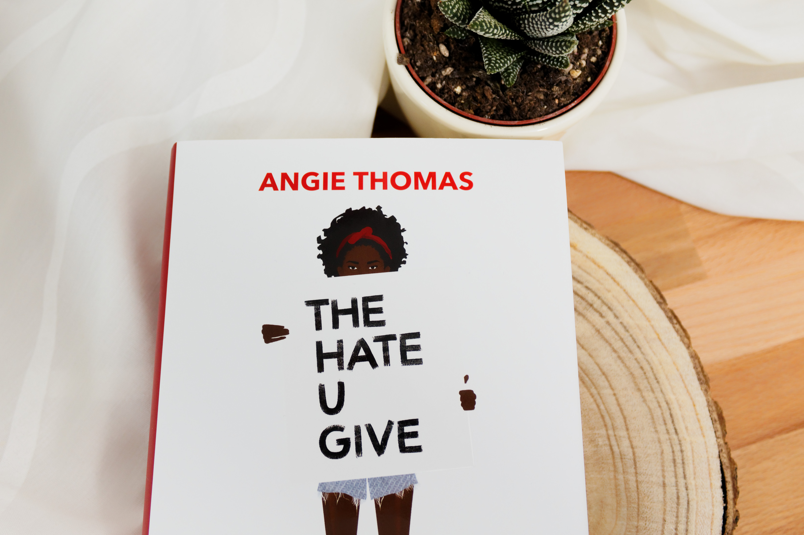

Endlich ist die Zeit gekommen um den zweiten Teil vom Mid-Year freak out book tag vorzustellen. Wer den ersten Post verpasst hat kann den gerne [hier](/midyear-freakout-booktag/) nachlesen. Also, los gehts!

### 8. Neuester fiktiver Schwarm

Die Frage fand ich schwer zu beantworten, da ich in den letzten Jahren ziemlich wenige Bookboyfriends gefunden hatte. Es gibt so viele tolle Charaktere, die ich sympathisch finde und richtig ins Herz geschlossen habe, doch es fehlten bei mir sehr oft die Schmetterlinge. Nach dem ich aber endlich zum letzten Teil der First-Reihe von Bianca Iosivoni gegriffen habe, war es endlich so weit. Bei Mason hatte ich endlich wieder Schmetterlinge im Bauch. Es hat mich dann auch fast gar nicht mehr gewundert, dass es ein Musiker war. Das letzte Mal hatte es mich richtig doll erwischt bei der Mayhem-Reihe von Jamie Shaw. Dort waren es Adam und Mike die mich ins schwärmen gebracht haben und Mason ist beiden sehr ähnlich. Er sucht die wahre große Liebe, ist witzig, lieb und sensibel. Ich hab das Buch "Der letzte erste Song" übrigens innerhalb von einem Tag verschlungen. Ich konnte einfach nicht mehr aufhören und musste wissen ob Mason und Grace es schaffen.

### 9. Neuester Lieblingscharakter

Als ich die Frage vor ein paar Monaten gelesen hatte war mir direkt klar, dass es hier nur eine richtige Antwort gibt: Ophelia aus der Spiegelreisende-Reihe! Wer mir auf Instagram schon ein bisschen folgt und meine Rezensionen zu der Reihe gelesen hat wird es schon wissen, aber ich liebe Ophelia mit meinem ganzen Herzen! Sie ist ein so toller Charakter! Sie ist super sympathisch durch ihre tollpatschige und ehrliche Art und auf der anderen Seite ist sie so mutig! Ihre Neugierde bringt sie öfters in Schwierigkeiten, aber das stört sie am Ende gar nicht mehr und sie macht während der Reihe eine so unglaublich bewundernswerte Entwicklung durch!
Auch wenn ich mich jetzt wiederhole, aber bitte gebt dieser Reihe und Ophelia eine Chance!

Umso glücklicher war ich dann, als ich auf Instagram die wunderschönen Custom Pops von [tigerlillyspops](https://www.instagram.com/tigerlillyspops/) entdeckt habe und sie auch noch eine Ophelia und einen Thorn selber macht. War natürlich klar, dass ich mir beide holen musste 😏

### 10. Buch das mich zum weinen gebracht hat

Das Buch hat mich nicht nur ein paar Tränen ausgelöst bei mir - nein, es hat mich richtig zum Schluchzen gebracht. Ich war so froh, dass ich es zu Hause gelesen habe und nicht irgendwo an einem öffentlichen Ort. Ich habe seit "All In" von Emma Scott nicht mehr so doll geweint bei einem Buch. Die komplette Stimmung in dem Buch ist schon von Seite 1 an sehr gedrückt und immer wieder musste ich kurze Atempausen einlegen, auch um mich innerlich zu sammeln und vorzubereiten auf das was noch kommt. Mich selbst hat es dann gar nicht mehr überrascht, dass ich beim letzten viertel durch einen Tränenschleiher hindurch gelesen habe.

Wenn ihr wissen möchtet worum es geht und wie mir das Buch an sich noch gefallen hat, schaut euch gerne meine [Rezension](/all-your-kisses-rezension/) dazu an.

### 11. Buch das mich glücklich gemacht hat

Diese wunderbare, herzerwärmende Grapic Novel Reihe kann einen nur glücklich machen. Ich liebe sie wirklich abgöttisch und bekomm auch einfach nicht genug davon. Den dritten Teil hatte ich sogar - total überraschend - noch vor Erscheinungsdatum geliefert bekommen und es dann auch direkt innerhalb von wenigen Stunden gelesen. Die Art wie Alice Oseman zeichnet und den Charakteren Leben einhaucht ist so toll! Die Reihe gibt es bis jetzt leider nur auf Englisch, aber durch die Bilder und das es eine Graphic Novel ist, ist sie wirklich sehr einfach zu lesen. Wenn ihr super süße, herzerwärmende m/m Geschichten mögt, dann müsst ihr unbedingt diese Reihe lesen!

### 12. Liebste Buchverfilmung die ich dieses Jahr gesehen habe

Ich weiß nicht wie es bei euch aussah dieses Jahr, aber irgendwie gab es in der ersten Jahreshälfte gar nicht so viele Buchverfilmungen, deshalb war die Frage für mich auch sehr einfach zu beantworten. Im Februar kam auf Netflix der zweite Teil der "To all the boys I've loved before" raus und den musste ich mir natürlich auch direkt ansehen. Das Buch habe ich gerne gelesen, wobei ich es etwas anstrengender fand als Teil 1. Gerade was die Kommunikationsprobleme zwischen Peter und Lara Jean betrafen. Aber es ist halt ein Jugendbuch und da sind solche Dramen immer vorprogrammiert. Der Film hat mir auch gut gefallen. An sich fand ich ihn wirklich gut umgesetzt, doch mir fehlten ein bisschen die Schmetterlinge die ich beim ersten Film hatte.

### 13. Liebste Rezension die ich bis jetzt geschrieben habe

Da ich zu wirklich jedem gelesenen Buch eine Rezension verfasse, war es schwierig für mich, mich auf eine festzulegen. Am Ende fand ich aber, dass ich meine Rezension zu [Muse of Nightmares](/muse-of-nightmares-1-rezension) wirklich klar und verständlich geschrieben hatte. Prinzipiell fällt es mir immer etwas schwer meine Gedanken zu ordnen und niederzuschreiben, sodass sie andere verstehen. Entweder schweife ich immer sehr schnell ab oder mir fallen immer nur die gleichen Adjektive ein wie "toll, wunderbar und gut". Bei Muse of Nightmares habe ich mir aber unter Anderem Notizen beim lesen gemacht und es war rückblickend eine richtige Hilfe für mich. So konnte ich die ganzen Eindrücke die ich beim Lesen hatte besser einordnen und sie niederschreiben.

### 14. Schönstes Buch, welches ich bis jetzt gekauft habe (oder geschenkt bekommen habe)

Wer mich kennt weiß, dass ich ein totales Cover Opfer bin. Sobald irgendwo im Buchladen ein Buch ein schönes Cover hat, zieht es mich magisch an. Zum Glück hab ich es in den letzten Jahren geschafft, meinen Konsumrausch und das blinde kaufen von Büchern mit schönen Covern einzuschränken. Trotzdem gibt es natürlich Bücher die ich mir dieses Jahr gekauft habe, welche vom Cover her wirklich ein Traum sind! Ich habe festgestellt, dass ich gerade Illustrationen und starke Farben sehr Liebe auf Covern. Doch es sind manchmal auch die Kleinigkeiten auf einem Cover, wie zum Beispiel bei One true Queen. Die Zeischnung die über das Gesicht der Königin geht, dazu ein bisschen Glitzer und ich bin hin und weg.

Bei Felix ever After haben mich die Farben total angesprochen. Die kräftigen Farben, dazu die schönen Kontraste und die Details, wie z.B. die Blumen und die Tattoos. Für mich ist es einst der schönsten Bücher in meinen Regalen.

### 15. Welches Buch muss ich noch bis Ende des Jahres gelesen haben?

Ich glaube hierzu muss ich gar nicht so viel erklären. Gerade nach der ganzen George Floyd Thematik habe ich festgestellt, dass mir da vieles an Wissen fehlt. Ich möchte helfen, ich möchte mich und den Umgang mit meinen Mitmenschen diesbezüglich verbessern, ich möchte dazu lernen und es noch besser verstehen können.
Es ist ein sensibles Thema und ich habe mich vor diesem Buch schon seit Jahren gedrückt, immer mit der Ausrede "das Thema ist mir zu Ernst. Es bereitet mir Bauchschmerzen". Ja es ist ein schwieriges Thema! Ja ich bekomme Bauschmerzen wenn ich an die Ungerechtigkeit denke! Aber es gibt Menschen da draußen, die müssen ihr Leben lang mit Rassismus und Vorurteilen kämpfen und da ist es doch das mindeste das ich versuche da Verständnis in mir aufzubauen. Genau deshalb möchte und muss ich dieses Buch noch bis Ende des Jahres lesen.

***

Ich hoffe euch hat es gefallen, mit mir zusammen die erste Jahreshälfte Revue passieren zu lassen und ich hoffe auch ihr fandet mein bisheriges Lesejahr genauso erfolgreich wie ich.