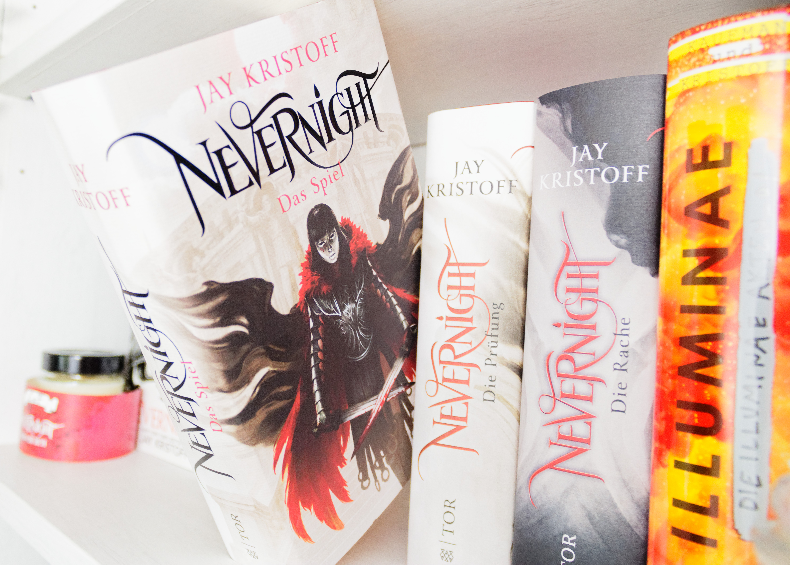
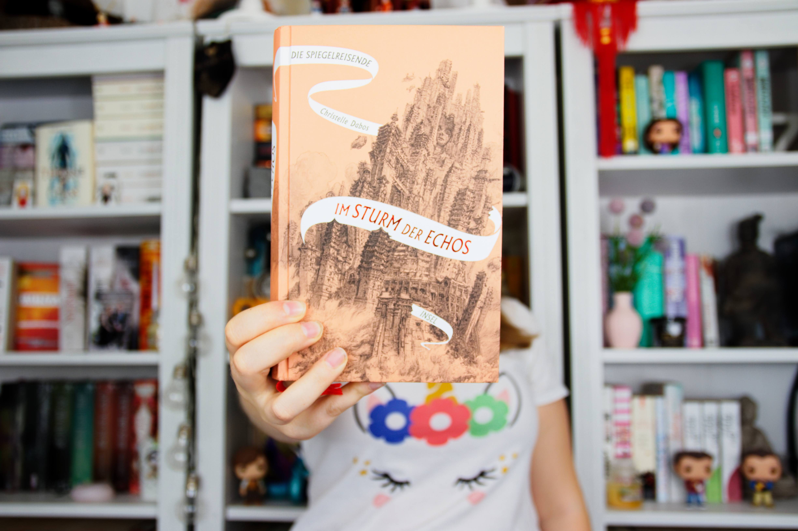
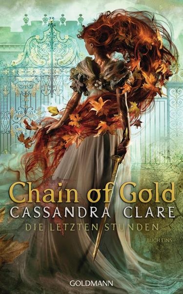
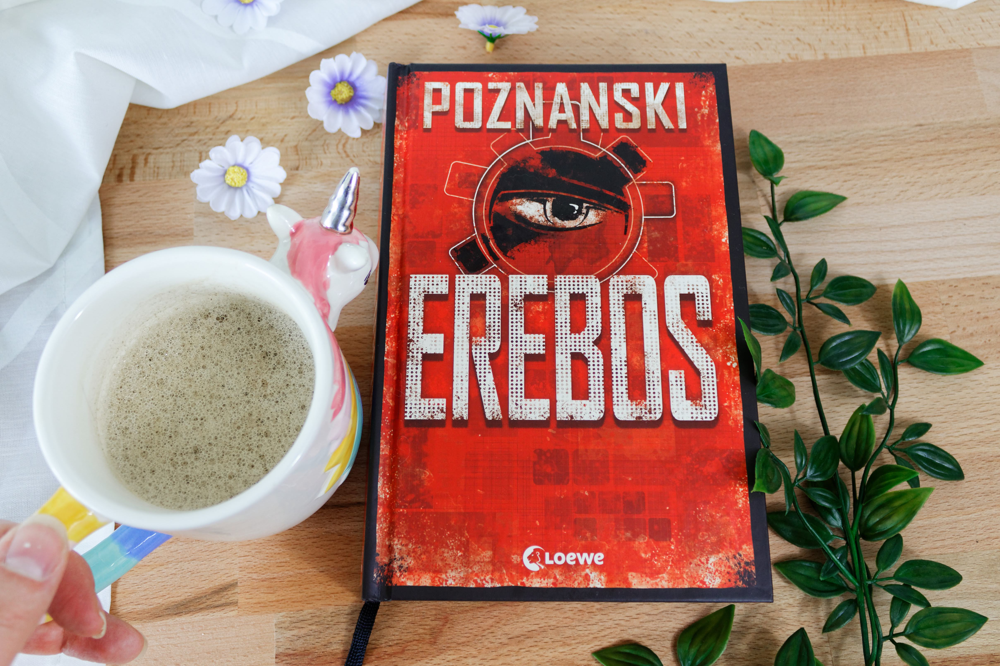
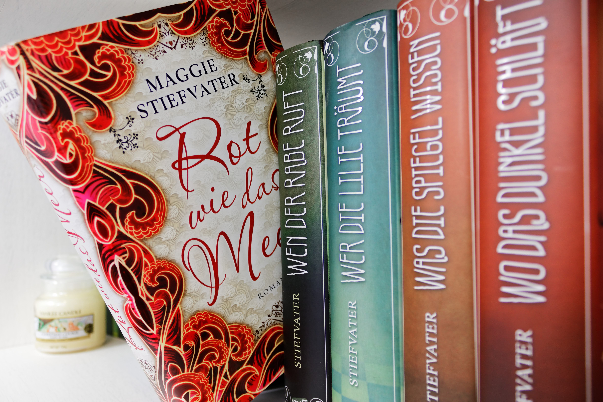
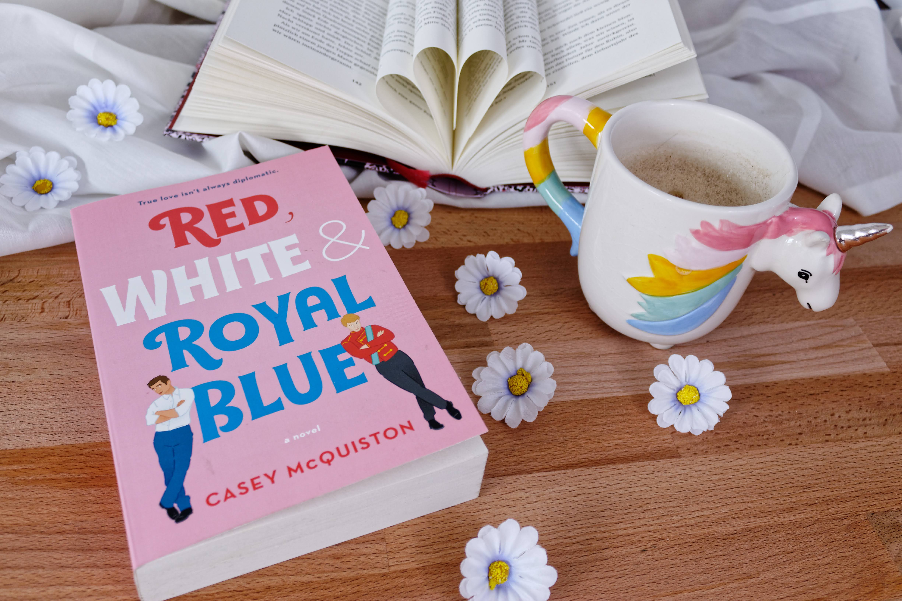

Oh wow! Wie schnell verging bitte die erst Jahreshälfte?! Ich hatte das Gefühl, dass gerade durch die Corona Pandemie die Zeit noch schneller vergangen is. Da war es natürlich auch nicht hilfreich, dass sich mein Zeitgefühl durch das ständige Home Office verabschiedet hat.  

Im Juni habe ich übrigens den Mid-Year Freak Out Book Tag auf Instagram entdeckt und wollte direkt mit machen. Trotz das es jetzt schon was länger her ist dachte ich mir, dass ich ihn euch im Nachhinein nochmal vorstelle. Um den Rahmen  von meinen Posts nicht zu sprengen habe ich es in zwei Teile aufgeteilt. In diesem Blog Post stelle ich euch die ersten sieben Fragen mit meinen Antworten vor. Teil zwei folgt dann zeitnah.

## Was ist der #midyearfreakoutbooktag ?

Der Book Tag ist eigentlich nichts anderes, als eine Ansammlung an Fragen die dir dabei helfen das halbe Lesejahr Revue passieren zu lassen. Ehrlich gesagt weiß ich auch nicht wer den Book Tag ins Leben gerufen hat. Also wer immer du bist: Danke! Denn mir hat es richtig viel Spaß gemacht die Fragen zu beantworten und ein kleines Zwischenfazit ziehen zu können. Also, auf geht's!

### 1. Bestes Buch, welches ich bis jetzt in 2020 gelesen habe

Die Frage war wirklich schwierig zu beantworten, weil ich bis Juni schon so viele tolle Bücher gelesen hatte, die es zum Großteil auch auf meine Jahreshighlights-Liste geschafft haben. Ich hab also lange überlegt und mich am Ende für den zweiten Teil der Nevernight Reihe entschieden. Warum? Das Buch war einfach grandios! Es ist durch den Schreibstil von Jay Kristoff schon sehr besonders sowohl die Charaktere als auch die Sprache sind so dreckig, roh und ehrlich, dass man gar nicht meint es könnte einem gefallen. Außerdem weiß der Autor wie er eine Geschichte durch Plot Twists spannend machen kann.

### 2. Beste Fortsetzung die ich bis jetzt in 2020 gelesen habe

Die Frage fand ich gemein, denn irgendwie beißt sie sich mit der ersten Frage, oder? Denn Nevernight 2 ist ja auch eine Fortsetzung, aber gut - so konnte wenigstens das andere Buch, welches sich mit Nevernight 2 ein Kopf-an-Kopf-Rennen geleistet hat, auch einen Sieg einheimsen.

Die Verschwundenen vom Mondscheinpalast ist der zweite Teil "der Spiegelreisende"-Reihe und es ist mein absoluter Favorit der Reihe. Wer mir auf Instagram schon ein bisschen folgt, weiß was für ein großer Fan ich von den Büchern bin. Die Verschwundenen vom Mondscheinpalast haben mich von der Reihe komplett überzeugen können. Ich war instant in die Welt, die Charaktere und den Schreibstil verliebt. Die Intrigen und dass man als Leser einfach niemanden so richtig trauen kann haben das ganze für mich perfekt gemacht. Wenn ihr die Reihe noch nicht kennt, dann gebt ihr unbedingt eine Chance!

### 3. Neuerscheinung auf die ich mich freue aber noch nicht gelesen habe

Wie oben schon erwähnt ist der Book Tag von Juni und ich habe natürlich auch Ende Juni daran teilgenommen. Da war meine Antwort ganz klar "Im Sturm der Echos", der vierte Teil "der Spiegelreisende"-Reihe und das, obwohl ich noch gar nicht den dritten Teil gelesen hatte. Teil zwei hat mich einfach so fasziniert und sprachlos zurückgelassen, dass ich den letzten Teil schon gar nicht mehr erwarten konnte.

Mittlerweile habe ich das Buch auch schon gelesen und wenn euch meine Meinung dazu interessiert dann schaut doch meine [Rezension](/sturm-der-echos-rezension/) davon an.

### 4. Meine am meisten erwartete Neuerscheinung für die zweite Jahreshälfte

Ihr glaubt gar nicht wie sehr ich mich auf dieses Buch freue! Nicht umsonst habe ich mir direkt zwei Buchboxen zum Buch dazu bestellt. Ich bin ein riesengroßer Cassandra Clare und Schattenjäger Fan! Ich liebe jedes einzelne Buch aus dem Shadowhunter-Universum und ich finde mit jedem Buch wird die Autorin besser. Jeder weitere Teil begeistert mich noch mehr und ich liebe es, wie viele unterschiedliche Charaktere sie erschafft. In jedem Buch gibt es so viele tolle diverse Figuren! Egal ob es Magnus Bane ist, oder Diana Wrayburn.  Cassie hat keine Angst davor solche Charaktere in ihre Welt mit einzubauen und sie hat überhaupt keine Hemmungen sozial kritische Themen mit aufzunehmen. Ob es der krasse Hass ist, den unsere Welt mittlerweile erfährt, oder eine unkonventionelle Dreiecks Geschichte. I just love it!

### 5. Größte Enttäuschung

Ich hab leider auch in der ersten Jahreshälfte zwei Enttäuschungen gehabt, wobei mich Erebos am meisten getroffen hatte. Das Buch klang so gut! Und der Hype - sowohl um das Buch, als auch um die Autorin - war in den letzten Jahren nie so richtig abgeebbt. Es wurde also Zeit für meinen ersten Poznanski und es wird mein letzter gewesen sein.

Das Buch an sich fand ich echt super langweilig. Es passierte wirklich gar nichts. Der Schreibstil und die Handlungen waren einfach nicht fesselnd für mich. Dazu kam noch das ich die Charaktere allesamt unsympathisch fand. Der super Gau passierte erst einige Wochen nach dem ich das Buch beendet hatte. Die Autorin hat sich öffentlich auf Twitter für JK Rowling und ihre transphoben Äußerungen eingesetzt. Da war das Fass bei mir einfach übergelaufen, auch wenn Poznanski nach der Flut an Nachrichten versucht hat sich zu rechtfertigen, war sie damit kein Deut besser als Frau Rowling. Ich kann solche Menschen einfach nicht unterstützen und möchte es auch gar nicht! Wen es interessiert was Ursula Poznanski von sich gelassen hat, kann gerne im Internet nach ihrem Twitter Account und ihren Tweets suchen (die Aktion fand im Juni statt).

### 6. Größte Überraschung

Zurückblickend hatte ich so einige positive Überraschungen dabei, doch ich habe mich speziell für dieses Buch entschieden. Rot wie das Meer, von Maggie Stiefvater, hatte mich nämlich schon direkt zu Beginn des Jahres positiv überrascht - nein, es hat mich regelrecht umgehauen! Ich liebe die Ravenboys Reihe der Autorin und ihren magischen Schreibstil und ich war neugierig auf die anderen Bücher von Maggie Stiefvater. Meine beste Freundin hatte mir bereits vor Jahren das Buch aufgedrückt und meinte direkt, dass es mir gefallen wird. Und doch war ich skeptisch. Das Buch lag also bestimmt 4 Jahre auf meinem Sub und dieses Jahr hab ich es endlich gewagt und zu dem Buch gegriffen. Leute! Ich weiß gar nicht warum ich so lange gewartet hatte.

Die Geschichte ist wieder total magisch und ich würde es als Urban Fantasy beschreiben. Noch dazu kommen Pferde drin vor, für mich als Pferdemädchen natürlich ein Traum! Die Charaktere sind wieder so toll ausgearbeitet und das Ende hat mich emotional total umgehauen. Das Buch schaffte es  direkt ein Jahreshighlight zu werden.

### 7. Neuer Lieblingsautor (Debut oder neu für mich)

Um dieses Buch kam man letztes Jahr gar nicht vorbei. Ich habe es gefühlt bei jedem zweiten Account gesehen, denen ich auf Instagram folge und dann kam die große Ankündigung, dass es sogar auf deutsch übersetzt wird und beim Drömer Knaur Verlag sein Plätzchen gefunden hatte. Ich habe mich also von 2019 verabschiedet mit dem Plan, das Buch auf deutsch zu lesen. Anfang 2020 war ich mir dann gar nicht mehr so sicher, als die liebe [Linda](https://www.instagram.com/linnliestundlabert/) nämlich das deutsche Buch gelesen hatte und es mit dem Originalen verglich. Sie hatte mir empfohlen es auf englisch zu lesen und wenn Linda dir etwas empfiehlt dann hältst du dich auch dran 😉 und ich bin sehr froh, dass ich es auf englisch gelesen hab!

Ich hatte überhaupt keine Schwierigkeiten mit der Sprache, ich fand es super leicht zu lesen und der Sarkasmus von Alex ging durch eine Übersetzung nicht verloren. Mir hat das Buch richtig gut gefallen und ich konnte den Hype endlich nachvollziehen. Wenn ihr gerne LGBTQ Bücher lest, im besonderen Gay-Romance, dann schreit das Buch quasi euren Namen! Ich hoffe wir werden noch in den Geschmack von vielen weiteren tollen Büchern der Autorin kommen.

*** 

Wenn euch dieser Beitrag gefallen hat, dann schaut gerne in der nächsten Woche oder danach nochmal vorbei um den zweiten Teil nicht zu verpassen.